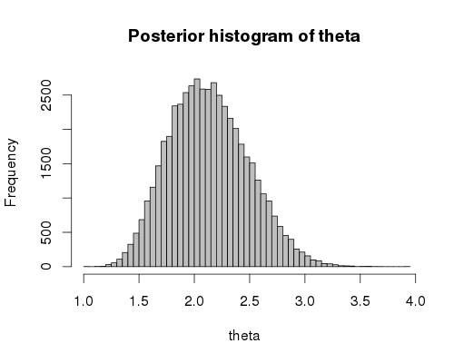

[Approximate Bayesian Computation (ABC)](http://en.wikipedia.org/wiki/Approximate_Bayesian_computation)
is a simulation based method for Bayesian inference. It is commonly used in
evolutionary biology to estimate parameters of demographic models.
Coala makes it easy to conduct the simulations for an ABC analysis and works
well together with the `abc` package for doing the estimation. 
To demonstrate the principle, we will estimate the parameter of an 
over-simplified toy model. 

Let's assume that we have 50 genetic loci from 10 individuals from a panmictic
population. We will use the site frequency spectrum of the data as a set of
summary statistics to estimate the scaled mutation rate, `theta`. Let's assume
we get the following frequency spectrum from the data:

```{r sfs}
sfs <- c(112, 57, 24, 34, 16, 29, 8, 10, 15)
```


We can now use coala to set the model up:

```{r model setup}
library(coala)
model <- coal_model(10, 50) +
  feat_mutation(par_prior("theta", runif(1, 1, 5))) +
  sumstat_sfs()
```

Note that we used `par_prior` to set a uniform prior between 1 and 5 for
`theta`. 

We can now easily simulate the model:

```{r simulate, cache=TRUE}
sim_data <- simulate(model, nsim = 2000, seed = 17)
```

For this toy model, we ran just 2000 simulations (to keep the time for
building this document within a reasonable range). A real analysis will need
many more, but you can reduce the simulation time by parallelizing them 
with the `cores` argument.


We need to prepare the simulation data for the `abc` package. We can use
the `create_abc_param` and `create_abc_sumstat` functions for this purpose:

```{r}
# Getting the parameters
sim_param <- create_abc_param(sim_data, model)
head(sim_param, n = 3)

# Getting the summary statistics
sim_sumstat <- create_abc_sumstat(sim_data, model)
head(sim_sumstat, n = 3)
```


Now, we can estimate the posterior distribution of `theta`:

```{r abc, fig.align="center", fig.width=5}
suppressPackageStartupMessages(library(abc))
posterior <- abc(sfs, sim_param, sim_sumstat, 0.05, method = "rejection")
hist(posterior, breaks = 20)
```

Due to the low number of simulations, this posterior should only
be treated as a rough approximation. We have prepared a version using a million 
simulations instead. Generating it took significantly longer (about two hours 
on a modern laptop), but we get a smoother estimate of the posterior 
distribution:

<center>

</center>
